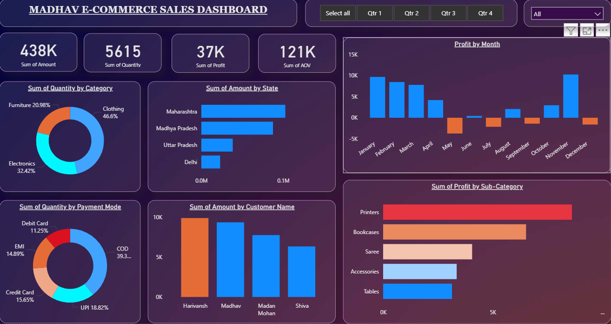

# Madhav E-Commerce Sales Dashboard 📊

This Power BI dashboard provides an interactive analysis of Madhav's e-commerce sales data, helping identify key trends in revenue, profit, and customer behavior.

---

## 📌 Overview
The dashboard gives a comprehensive view of:
- **Total Sales (Amount)**: 438K
- **Total Orders**: 5,615
- **Total Profit**: 37K
- **Average Order Value (AOV)**: 121K

---

## 📊 Key Insights
1. **Category Performance**
   - Clothing leads with **46.6%** of total quantity sold.
   - Electronics and Furniture follow with **32.42%** and **20.98%** respectively.

2. **State-Wise Sales**
   - Maharashtra and Madhya Pradesh are top-performing states.
   - Uttar Pradesh and Delhi show smaller but notable contributions.

3. **Payment Modes**
   - Cash on Delivery (COD) is the most preferred payment mode (39.3%).
   - UPI and Credit Card follow with **18.82%** and **16.55%**.

4. **Profit Trends**
   - Significant profits in January, February, and December.
   - Losses observed in May and June.

5. **Top Customers**
   - Harivansh and Madhav are the highest contributors in terms of sales amount.

6. **Sub-Category Profitability**
   - Printers generate the highest profit, followed by Bookcases and Sarees.

---

## 🛠️ Tools Used
- **Power BI**: For building the interactive dashboard.
- **Data Cleaning & Modeling**: Performed within Power BI Query Editor.

---

## 📂 Files in This Repository
- `Madhav_Ecommerce_Sales.pbix` → Power BI dashboard file.
- `madhav_sales_data.xlsx` → Raw data for analysis.
- `Madhav_Dashboard_Preview.png` → Screenshot of the dashboard.

---

## 📷 Dashboard Preview

---

## 🚀 How to Use
1. Download the `.pbix` file.
2. Open it in **Power BI Desktop**.
3. Load the included dataset or replace it with your own.
4. Explore the interactive visualizations and filters.

---

## 📄 License
This project is open-source and available for practice and learning purposes.
